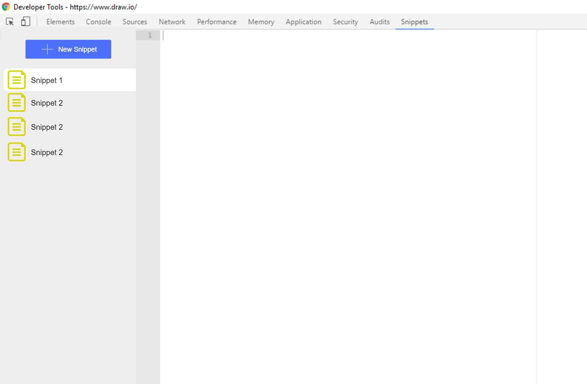

# Table of Contents

1. [Minimum Viable Product](#mvp)
2. [0.2.0](#020)
3. [Next few versions](#next-few-versions)
4. [In the future](#in-the-future)

# MVP

### *0.1.0*

The Minimum Viable Product for *Snippets*

## Features

- [ ] User Interface
  - [x] Create snippets
  - [x] Select snippet to edit
  - [x] Rename snippets
  - [ ] Delete snippets
- [x] Data
  - [x] Store snippets in Chrome Sync storage

## Mockup

# 0.2.0

* Allow selection of editor theme
  * Theme interface components too?
* Better linting
  * Current linting enforces semicolons, for example

# Next few versions

* Allow to snippets to be reordered
* Allow sidebar to be hidden
* Allow snippet to be easily run in the console

# In the future

* Add popup page (the page that appears when you click the extension badge in the top right)
  * Allow snippets to be run, reordered, renamed, or opened from there
  * Allow creation of key-bindings
  * Allow creation of shortcut urls (to use in bookmarks)?
